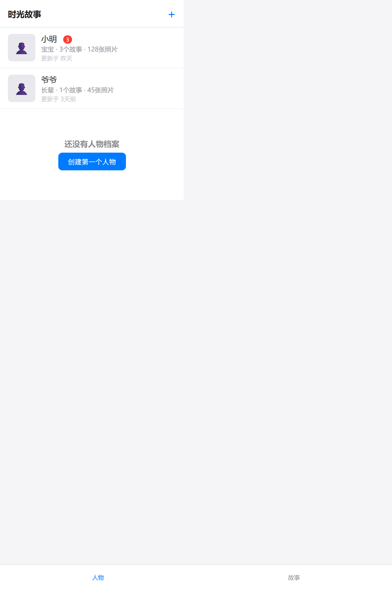
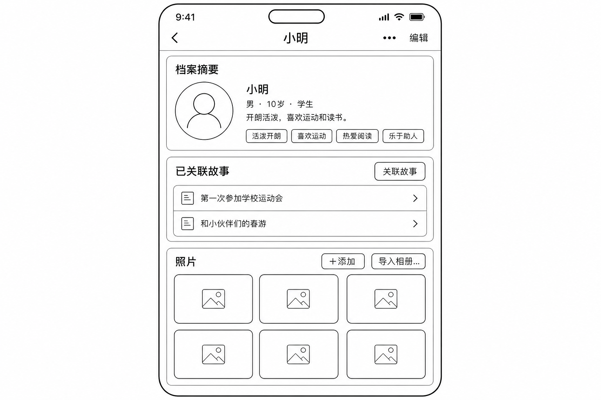
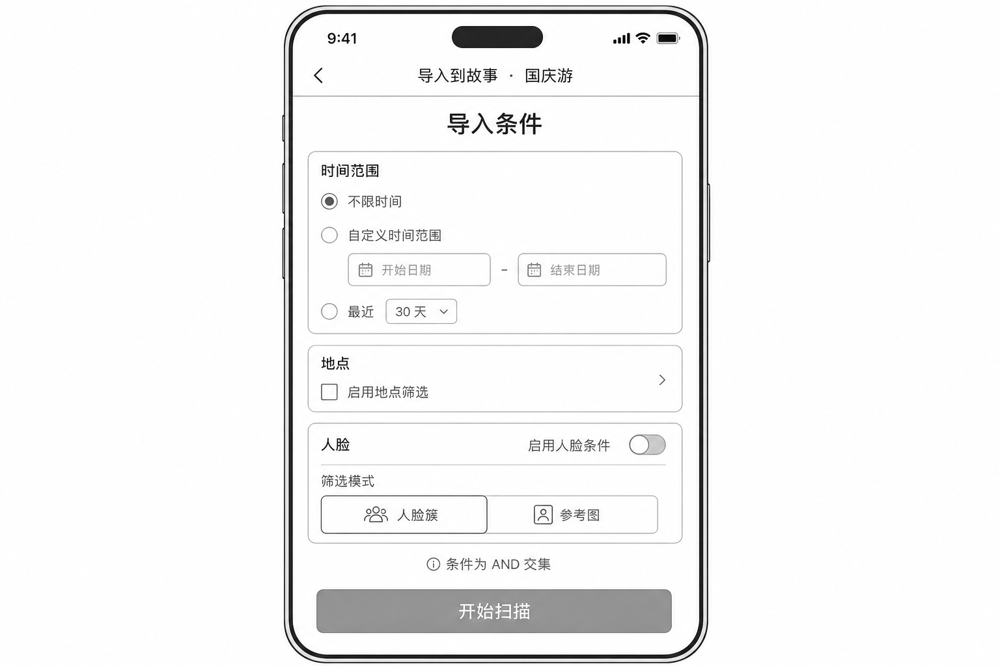
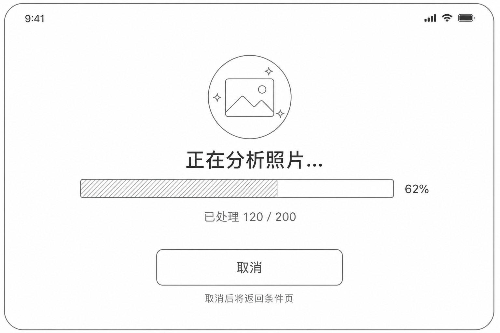
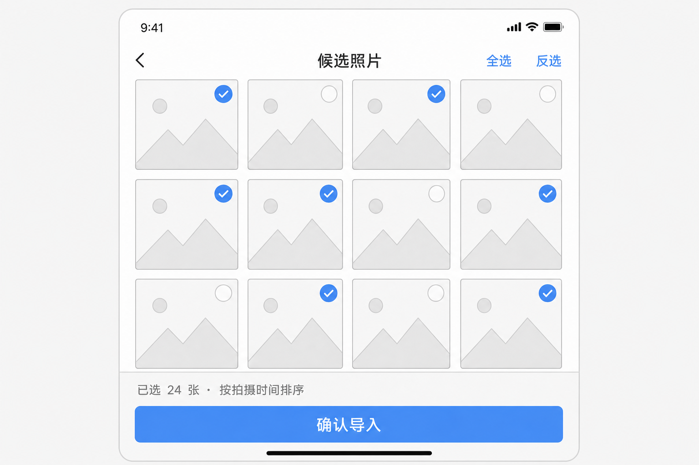
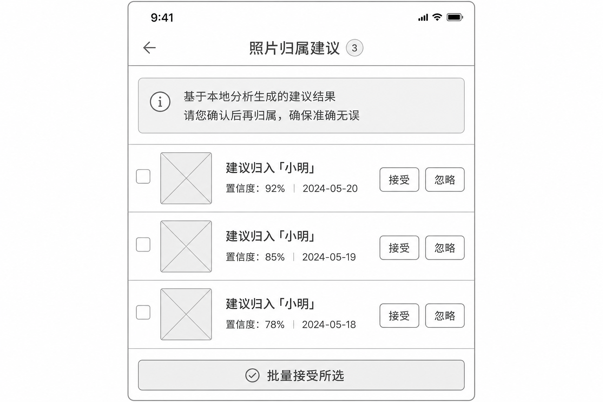
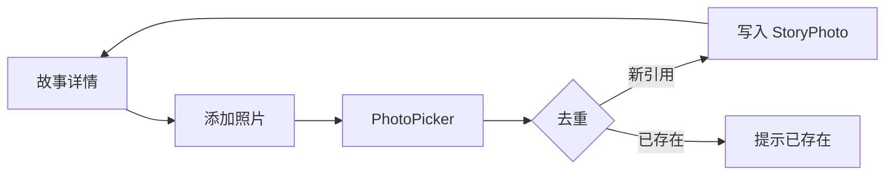
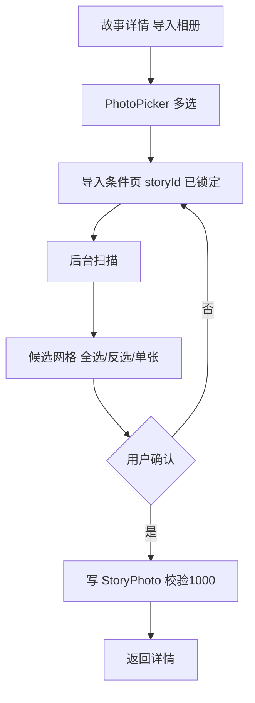
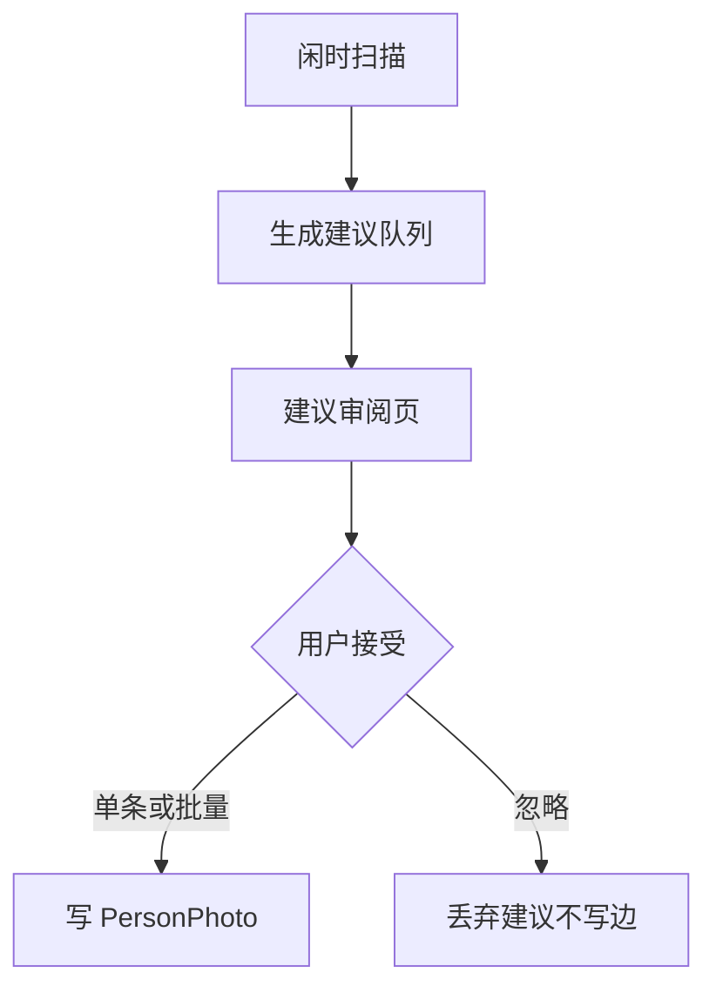

# 时光故事（TimeStory）MVP UI 原型稿

**文档性质**：交互与界面结构原型（对齐需求 [时光故事-MVP需求说明-v4.md](../requirement/时光故事-MVP需求说明-v4.md) **V4.3**）  
**版本**：v1.2  
**日期**：2026-05-06  
**原型图资源**：与本稿同目录 [assets/](./assets/)（PNG 线框示意，可与 §4 ASCII 对照）  
**设备**：手机（Stage 模型，与技术方案 `pages/*` 一致）  
**主题**：跟随系统深色 / 浅色（MVP §9.1）

---

## 1. 设计目标与原则

| 原则 | UI 体现 |
|------|---------|
| 双核独立 | 「人物」「故事」同级 Tab，无强制先后；空态文案说明可任选入口。 |
| 智能不越权 | 导入扫描、人脸建议均以 **候选页 + 明确「确认写入」** 收束，无静默勾选写入。 |
| 存储不动 | 隐私页、选图后说明条：**仅引用系统相册、不落盘原图**；列表不暗示「已备份」。 |
| 可恢复任务 | 长扫描展示进度、取消、失败重试（IM-09）；不打断主导航返回（任务在后台或 BottomSheet 持续提示，实现可二选一，须一致）。 |

**语言**：MVP 中文（§9.3）。

---

## 2. 信息架构与导航

### 2.1 顶层结构

```
┌─────────────────────────────────────┐
│  标题：时光故事（或品牌字标）          │
│  [可选] 更多 ⋮ → 隐私说明 / 人脸与索引设置   │
├─────────────────────────────────────┤
│                                     │
│           【主内容区】                │
│                                     │
├─────────────────────────────────────┤
│  [ 人物 ]    [ 故事 ]   ← Tabs 固定底栏或顶栏二选一，建议底栏（拇指区） │
└─────────────────────────────────────┘
```

- **列表排序**：人物列表、故事列表均为 **最近更新降序**（§7）。
- **全局更多**（建议）：`隐私与数据说明`、`人脸与本地索引`（含 IM-10 开关、首次说明入口）、`关于`（版本、崩溃上报说明摘要链到隐私 §14）。

### 2.2 页面地图（逻辑路由）

| 路由域 | 页面 | 需求锚点 |
|--------|------|----------|
| `shell` | 启动 / 首次轻引导（可选） | §7 |
| `person` | 人物列表、新建/编辑、人物详情 | PE-01～06 |
| `story` | 故事列表、新建/编辑、故事详情 | ST-01～07 |
| `import` | 相册导入向导（形态一 / 二共用骨架） | §8.4.1～2、IM-01～09 |
| `suggest` | 人脸关联建议审阅（形态三） | §8.4.3、IM-03 |
| `privacy` | 隐私与说明静态页 | PR-01 |
| `settings` | 人脸开关、清除特征缓存（若实现） | IM-10、PR-02 |

形态三 **独立入口**：采用人物 Tab 顶栏 **徽章入口**（有未读建议时显示数量）。

---

## 3. 组件与模式约定

| 模式 | 用法 |
|------|------|
| **列表** | `List` + `ListItem`；左图右文：故事/人物封面缩略图 + 标题 + 副信息一行（时间范围 / 人物类型标签）。 |
| **照片网格** | 详情内 `Grid`；**拍摄时间降序**展示（§6.2），无拖动排序。 |
| **失效态缩略图** | 本地已删：灰阶 + 图标「已失效」；云端/网络不可用：区分文案「暂不可访问」等（ER-01）。点击进单张操作：移除边 / 删除引用。 |
| **确认 destructive** | 删除人物、删除故事、清空建议需二次确认对话框。 |
| **单故事上限** | 第 1001 张写入前 **Toast + 对话框阻断**（ST-07）。 |

---

## 4. 屏幕原型

以下为 **可视化线框图**（示意布局、层级与文案位置；配色与控件以系统主题为最终准则）与 **ASCII 线框**（便于 diff 与评审批注）。二者描述同一套界面。

### 4.0 可视化线框图

| 图 | 对应界面 | 说明 |
|----|----------|------|
| 图 1 | 主导航 + 人物列表 | 底栏 Tab「人物 / 故事」、列表行、右上角 `[+]` |
| 图 2 | 人物详情 | 档案摘要、已关联故事、照片区「添加 / 导入相册」、网格 |
| 图 3 | 导入条件（形态一 / 二共用） | 目标故事/人物上下文、时间 / 地点 / 人脸、AND 说明、「开始扫描」 |
| 图 4 | 扫描进度 | IM-09 进度与取消 |
| 图 5 | 候选确认 | 全选 / 反选、勾选网格、「确认导入」 |
| 图 6 | 形态三：人脸归属建议 | 说明条、单条接受/忽略、批量操作 |













### 4.1 人物列表（ASCII）

```
┌──────────────────────────────┐
│ 人物                    [+]  │
├──────────────────────────────┤
│ ┌──┐ 小明 · 宝宝              │
│ │图│ 3 个故事 · 128 张照片    │
│ └──┘ 更新于 昨天              │
├──────────────────────────────┤
│ ┌──┐ 爷爷 · 长辈              │
│ │图│ 1 个故事 · 45 张照片      │
│ └──┘ 更新于 3 天前            │
├──────────────────────────────┤
│ （空态）                      │
│ 还没有人物档案                │
│ [ 创建第一个人物 ]            │
└──────────────────────────────┘
```

- `[+]`：**新建人物** → 表单页（§6.1 Person）。
- 行点击 → **人物详情**。

### 4.2 人物新建 / 编辑（ASCII）

```
┌──────────────────────────────┐
│ ← 新建人物            [保存] │
├──────────────────────────────┤
│      ┌──────────┐            │
│      │ 头像占位  │ [更换头像] │  ← PhotoPicker，可选
│      └──────────┘            │
│ 显示名 *  [____________]     │
│ 类型      [ 其他 ▼ ]         │  ← 宝宝/成人/长辈/其他
│ 生日      [ 选择日期 ]       │
│ 性别      ○男 ○女 ○未填      │
│ 备注      [ 多行文本____ ]   │
└──────────────────────────────┘
```

### 4.3 人物详情（ASCII）

```
┌──────────────────────────────┐
│ ← 小明              [⋮ 编辑] │
├──────────────────────────────┤
│ 档案摘要行（类型·生日·性别）   │
├──────────────────────────────┤
│ 已关联故事        [关联故事] │
│ · 2025 国庆游                 │
│ · 家庭聚会 2024               │
├──────────────────────────────┤
│ 照片（按时间晚→早）  [+ 添加] │
│ [导入相册…]  ← 形态二入口      │
├──────────────────────────────┤
│ ┌─┐┌─┐┌─┐┌─┐                 │
│ │ ││ ││ ││ │  …              │
│ └─┘└─┘└─┘└─┘                 │
└──────────────────────────────┘
```

- **添加**：手动 PhotoPicker（PE-04）→ 去重提示（PH-01）。
- **导入相册**：进入 **导入向导**，目标人物已锁定（IM-02）。
- **关联故事**：BottomSheet 多选故事列表 + 勾选建立/解除 PersonStory（PE-06）。
- 单张照片点入 → 大图预览 + **从人物移除**（PE-05）。

### 4.4 故事列表 / 新建 / 编辑 / 详情（ASCII）

与人物侧对称：

- **故事列表**：封面 + 标题 + 时间范围一行 + 更新日期；`[+]` 新建。
- **故事表单**：标题*、描述、起止日期（可同日）、地点（手填）、自定义标签（标签 chips + 输入）、封面「使用首张 / 选择故事内照片」。
- **故事详情**：元信息区 + **已关联人物** `[关联人物]` + **照片网格** `[+ 添加]` `[导入相册…]`（形态一，IM-01）。
- **ST-07**：在「添加」「导入确认」两处做剩余额度提示（如「还可添加 n 张，上限 1000」）。

### 4.5 相册导入向导（形态一 / 二共用，ASCII）

**步骤条建议**：`选图` → `导入准备` → `条件` → `扫描中` → `候选确认` → `完成`

#### 步骤 A：选图（系统 PhotoPicker）

- 由 **「导入相册…」** 或统一加号中的「批量导入」触发；形态一进入前已带 `storyId`，形态二已带 `personId`。
- 顶部 **面包屑**：`导入到故事：{标题}` / `导入到人物：{显示名}`（需求：目标明确）。

#### 步骤 A.5：导入准备（新增）

- 选图返回后进入「导入准备」进度页，执行本批次 URI 的元数据导入（拍摄时间、坐标等）。
- 准备完成后自动进入条件页；若用户取消导入准备，返回上一步并不写业务边。

#### 步骤 B：配置条件

```
┌──────────────────────────────┐
│ ← 导入条件                    │
│ 目标：故事「国庆游」          │
├──────────────────────────────┤
│ 时间范围（形态一、二可选用）   │
│  ○ 自定义  [起] [止]         │
│  ○ 单日    [ 日期 ]          │  ← IM-04
├──────────────────────────────┤
│ 地点（形态一；形态二若启用）   │
│  [✓] 启用地点筛选            │  ← IM-05，无数据进「未知」不崩
├──────────────────────────────┤
│ 人脸（若开启人脸总开关）       │
│  [✓] 启用人脸条件            │
│  模式：◉ 人脸簇  ○ 参考图    │  ← IM-06 默认簇
│  （形态二：参考图可选与头像比对）│
├──────────────────────────────┤
│ 多条件关系：仅 **同时满足**    │  ← IM-07 AND，无 OR
│ [ 开始扫描 ]                 │
└──────────────────────────────┘
```

- **首次**勾选人脸条件时弹出 **说明 + 开关**（与设置页 IM-10 一致）。
- 形态二默认补充说明文案：系统将从已选照片中分析与目标人物相似的面孔。

#### 步骤 C：扫描中

```
┌──────────────────────────────┐
│ 正在分析照片…                │
│ ████████░░░░  62%            │
│ 已处理 120 / 200             │
│ [ 取消 ]                     │  ← IM-09
└──────────────────────────────┘
```

- 取消：确认对话框；确认后按钮进入「正在取消...」并禁用，任务停止后返回条件页（保留已选条件）。

#### 步骤 D：候选确认（IM-08）

```
┌──────────────────────────────┐
│ 候选照片          [全选][反选]│
├──────────────────────────────┤
│ ┌─┐┌─┐┌─┐┌─┐                 │
│ │✓││ ││✓││ │  每张可点切换勾选 │
│ └─┘└─┘└─┘└─┘                 │
├──────────────────────────────┤
│ 已选 24 张 · 写入后按拍摄时间排序 │
│ [ 确认导入 ]  （主按钮）       │
└──────────────────────────────┘
```

- 确认前校验 **ST-07**：若超出上限，对话框说明阻断。
- 完成后 **Toast** + 导航回故事/人物详情并刷新网格。

### 4.6 形态三：人脸关联建议审阅（ASCII）

```
┌──────────────────────────────┐
│ ← 照片归属建议                │
├──────────────────────────────┤
│ 以下为本地分析推测，需您确认   │
│ 不会自动写入相册              │
├──────────────────────────────┤
│ ┌────┐ 建议：归入「小明」      │
│ │缩略│ 置信度 · 2025-10-02    │
│ └────┘ [接受] [忽略]          │
├──────────────────────────────┤
│ … 列表或网格批量模式 …        │
│ [ 批量接受所选 ]              │
└──────────────────────────────┘
```

- **仅**用户点击接受写入 `PersonPhoto`（IM-03）。
- 与导入页流程分离，**不从选图开始**（§8.4.3）。
- 关闭人脸开关时弹二次确认并提供双选项：仅关闭后续分析 / 关闭并清空现有建议（默认推荐清空）。

### 4.7 隐私与说明（PR-01，ASCII）

静态页，分块：**数据存哪**、**照片与云相册**、**人脸与索引**、**崩溃诊断信息收集**（§14）、**卸载与恢复预期**（与 §10 验收一致）。

### 4.8 人脸与索引设置（ASCII）

- **总开关**（IM-10）：关闭后停止新索引 / 新建议；已有关联保留。
- **清除本地人脸缓存**（PR-02，若实现）：二次确认 + 说明影响。

---

## 5. 关键用户流程（Mermaid）

### 5.1 手动加照片到故事



### 5.2 形态一：故事定向导入



### 5.3 形态三：建议确认



---

## 6. 空态、权限与错误

| 场景 | 文案 / 行为 |
|------|-------------|
| 零数据首次启动 | 双 Tab 均可进；可选 **一页式引导**（「从人物或故事任一入口开始」）可跳过。 |
| 媒体权限拒绝 | ER-02：说明原因 + 跳转系统设置链接；避免循环弹窗。 |
| 扫描失败 | IM-09：**重试** + 错误简述（网络/存储/未知分类可选）。 |
| 低端机降级 | IX-02：条件页顶部 **横幅**「已为人脸分析降低精度/关闭部分能力」。 |

---

## 7. P1 与后续（不在 MVP 必画高保真）

- **PH-01 UI**：「加入故事时一键同时加入某人物」—— MVP 数据就绪即可，界面可占位或不做。
- **里程碑**（§8.8）：若纳入，人物详情增加「记录」子 Tab，与本文 v1 并行升版。

---

## 8. 交付物建议

| 类型 | 说明 |
|------|------|
| 本文 | 结构、文案、流程、栅格与状态清单，供评审与 ArkUI 对齐。 |
| §4.0 PNG | `assets/` 下线框图，可作评审投屏与 Figma 参照底图。 |
| 设计工具 | 可将 §4 转为 Figma / MasterGo 帧；沿用鸿蒙 **标准控件** 减少定制。 |
| 验收 | 与 MVP §10 清单逐项对照走查。 |

> 图稿同步说明（2026-05-06）：本文 v1.2 的文字与流程已按评审决议更新；`assets/` 中 **02 / 03 / 05 / 06** 线框 PNG 已按 F5 补齐导出；研发对版差异清单（架构 + 实现）见 [2026-05-06-F6-研发对版差异清单.md](../meeting/2026-05-06-F6-研发对版差异清单.md)（F6 已闭环）。

---

## 9. 修订记录

| 版本 | 日期 | 说明 |
|------|------|------|
| v1.0 | 2026-05-05 | 首版，依据 MVP V4.3 + 白皮书 V1.3 + 技术方案页面域 |
| v1.1 | 2026-05-05 | 增加 §4.0 可视化线框 PNG（`assets/prototype-01`～`06`），与 ASCII 对照 |
| v1.2 | 2026-05-06 | 对齐 05-06 交互评审纪要：形态三入口改为人物顶栏徽章、人物详情文案改「关联故事」、导入流程新增「导入准备」、取消语义与人脸开关策略收敛 |

---

**文档结束**
